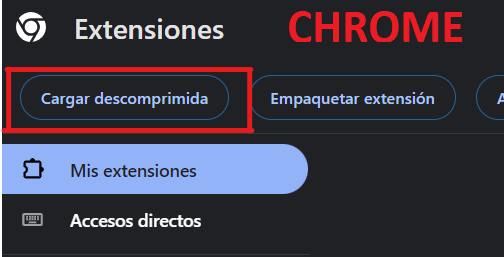

# Instalación

1. **Clona el proyecto**
>Guardarlo en un sitio que no vayas a borrar sin querer

`git clone https://github.com/IsmaCastro1/JwtExtension.git`
---

2. **Pulsa en los tres puntos del navegador y abre el panel de extensiones.**

    

---

3. **Activa el modo desarrollador.**

  
   

---

4. **Instala la extensión.**

  >*Selecciona la carpeta raíz de la extensión.*

  
   

---

# Uso
>Abre la extensión en una app y te copiará y almacenará automáticamente el token y con el botón de obtener podrás volver a copiarlo en cualquier pestaña.

>Si el token caduca, repite el proceso anterior.

